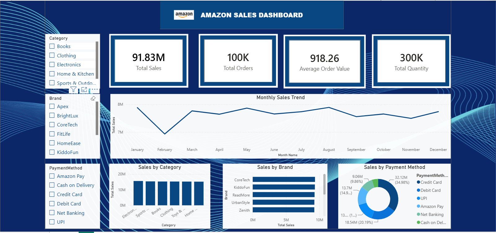

# Amazon Sales Analytics Dashboard

## 📊 Project Overview

This project focuses on analyzing Amazon sales data and creating an interactive dashboard using **Power BI**. The project was developed to identify sales trends, product performance, and other key business insights through data visualization.

## 🛠️ Tools & Technologies

* **Power BI** – Dashboard development and data visualization
* **Power Query** – Data cleaning and transformation
* **DAX** – Calculations and KPI development
* **CSV** – Source dataset
* **AI Tools** – Used as an assisting tool during project development and analysis

## 🔍 Data Preparation

The sales dataset was cleaned and transformed in Power BI before analysis. This included preparing the data for visualization, checking data consistency, and structuring the dataset for reporting.

## 📈 Dashboard Features

The interactive dashboard provides insights into:

* Sales performance
* Product performance
* Sales trends
* Key Performance Indicators (KPIs)

## 🖥️ Dashboard Preview

## 📂 Project Files

* Amazon_Sales_Dashboard.pbix – Power BI dashboard file
* `amazon_sales_data.csv` – Source sales dataset
* `amazon-sales-dashboard.png` – Dashboard preview

## 📚 Dataset Source

The dataset was obtained from **Kaggle** and used for educational and portfolio analysis.

## 🤖 AI Assistance

AI tools were used as a supporting resource during the development of this project, including assistance with analysis, problem-solving, and project documentation. The dashboard, data preparation, and final visualizations were developed and reviewed by the project author.
